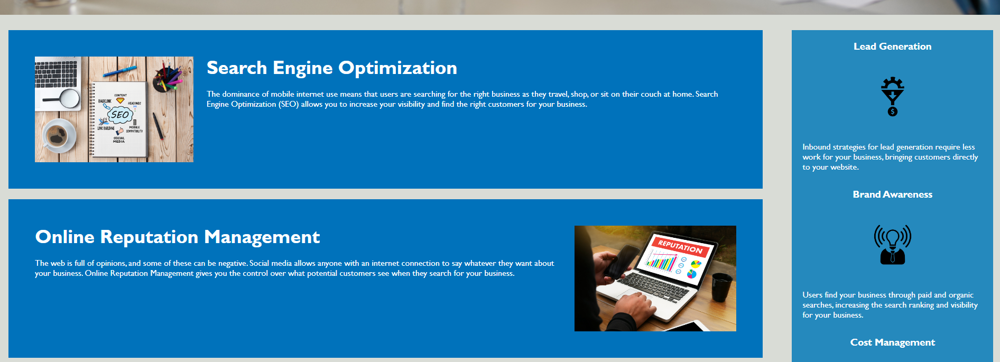
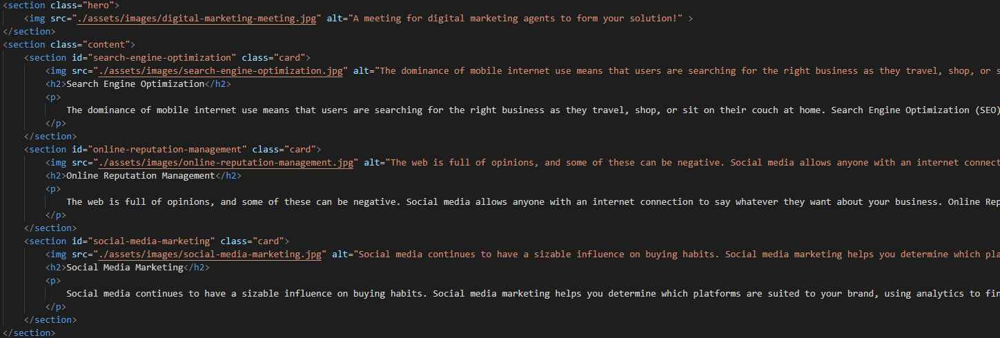

# Horiseon Landing Page Accessibility Code Refactor

## Technology Used 

| Technology Used         | Resource URL           | 
| ------------- |:-------------:| 
| HTML    | [https://developer.mozilla.org/en-US/docs/Web/HTML](https://developer.mozilla.org/en-US/docs/Web/HTML) | 
| CSS     | [https://developer.mozilla.org/en-US/docs/Web/CSS](https://developer.mozilla.org/en-US/docs/Web/CSS)      |   
| Git | [https://git-scm.com/](https://git-scm.com/)     |  

## Description 

[Visit the Deployed Site](https://bryannguyen9.github.io/3-20-23-challenge/)

This project was started with the goal in mind to make this landing page more accessible to those with disabilities. This is the Horiseon Social Solution Services landing page that focuses primarily on search engine optimzation, online repuatation management, and social media marketing. The end result was a code refactoring of the landing page that created a more accessible and intuitive page that did not visually change or alter functionality. 

This solves the problem of meeting accessibility standards for Horiseon as they are trying to be more impactful, accessible, and welcoming to all reaches around the world.

In this project I learned a lot about the methodology and thinking behind code refactoring, as well as HTML semantic elements that brought extra functionality and accessibility to HTML pages.

My project stands out because of the clean addition to nav links, section instead of div tags, and alt attributes to images that create a more dynamic experience for those with accessibility needs or that use screen readers.

Again here is a link to my fully deployed website: 
[Site Landing Page](https://bryannguyen9.github.io/3-20-23-challenge/)

## Table of Contents

* [Code Refactor Example](#code-refactor-example)
* [Usage](#usage)
* [Learning Points](#learning-points)
* [Author Info](#author-info)
* [Credits](#credits)
* [License](#license)

## Code Refactor Example

What are the steps required to install your project? Provide a step-by-step description of how to get the development environment running.

```html
<div class="header">
        <h1>Hori<span class="seo">seo</span>n</h1>
        <div>
            <ul>
                <li>
                    <a href="#search-engine-optimization">Search Engine Optimization</a>
                </li>
                <li>
                    <a href="#online-reputation-management">Online Reputation Management</a>
                </li>
                <li>
                    <a href="#social-media-marketing">Social Media Marketing</a>
                </li>
            </ul>
        </div>
    </div>
```

Converting the above non-semantic div with the class of 'header' to an appropriate [<header> semantic element](https://www.w3schools.com/html/html5_semantic_elements.asp). 

```html
      <header>
        <h1>Hori<span class="seo">seo</span>n</h1>
            <nav>
                <ul>
                    <li>
                        <a href="#search-engine-optimization">Search Engine Optimization</a>
                    </li>
                    <li>
                        <a href="#online-reputation-management">Online Reputation Management</a>
                    </li>
                    <li>
                        <a href="#social-media-marketing">Social Media Marketing</a>
                    </li>
                </ul>
            </nav>
    </header>
```

This change require some additional modification to the CSS selector: 

```css
.header {
    padding: 20px;
    font-family: 'Trebuchet MS', 'Lucida Sans Unicode', 'Lucida Grande', 'Lucida Sans', Arial, sans-serif;
    background-color: #2a607c;
    color: #ffffff;
}
```

No longer targeting the element on the page with the class of 'header' but instead the css selector targeting the 'header' element 

```css
header {
    padding: 20px;
    font-family: 'Trebuchet MS', 'Lucida Sans Unicode', 'Lucida Grande', 'Lucida Sans', Arial, sans-serif;
    background-color: #2a607c;
    color: #ffffff;
}

```

## Installation

To clone down my repository to your computer:

1. Access my github --here--> [My Github](https://github.com/bryannguyen9/3-20-23-challenge/)
2. Clone it down to your computer by clicking the <span style="color:green">green</span>. code button
3. Copy the ssh key
4. Then using "git clone 'paste ssh key here'
5. Type 'code .' into your terminal/gitbash to see code

To access the live website simply go to [Site Landing Page](https://bryannguyen9@github.io/3-20-23-challenge/)

## Usage 

Here we see the header links on the landing page and how when click they lead 
to the corresponding benefit cards lower in the site:




Here we see the header links and how I converted from a "header" class into an actual header tag, I also changed links and used nav tags in order
to create a more accessible website as a whole: 


This is a screenshot of the header links and where they lead to which is basically scrolling to the actual benefit cards further down within the website.
I also changed the div tags into section tags as well as included alt atributes for images for those using screen readers.





## Learning Points 

There was a lot of research done in regards to what exactly are HTML elements.
This combined with the website goal of being a more accessible website lead me 
to learn about accessibility standards that are currently regarded as the standard
within the world of HTML and accessibility.

This is where I read about government accessibility standards:[ADA.gov](https://www.ada.gov/resources/web-guidance/)

I then had to research a lot about semantic HTML elements and these websites helped
me the most.

[W3 schools](https://www.w3schools.com/html/html_accessibility.asp)
[Developer Mozilla](https://developer.mozilla.org/en-US/docs/Learn/Accessibility/HTML)

These websites taught me not only different html elements but the meaning and reasoning
behind semantic and accessible elements that I incorporated into this website
such as section, aside, and nav tags.

## About Me

Hi, my name is Bryan Nguyen I am an up and coming full-stack web developer working
on getting into the space with projects that support both my growth, belief, and imagination. I hope to one day work within the realm of AI, web-development, and even site-reliability/the space of cyber-security.


### My links

* [Portfolio](Coming Soon!)
* [LinkedIn](https://linkedin.com/in/bryan-n-08ba768a)
* [Github](https://github.com/bryannguyen9)

## Credits

# Special thanks to David Chung: 
[His github portfolio:](https://github.com/dchung13/)

# Special thanks to these reference websites that taught me accessibility standards and semantic elements:

[W3 schools](https://www.w3schools.com/html/html_accessibility.asp)
[Developer Mozilla](https://developer.mozilla.org/en-US/docs/Learn/Accessibility/HTML)

## License

MIT License

Copyright (c) [2023] [Bryan-Nguyen]

Permission is hereby granted, free of charge, to any person obtaining a copy
of this software and associated documentation files (the "Software"), to deal
in the Software without restriction, including without limitation the rights
to use, copy, modify, merge, publish, distribute, sublicense, and/or sell
copies of the Software, and to permit persons to whom the Software is
furnished to do so, subject to the following conditions:

The above copyright notice and this permission notice shall be included in all
copies or substantial portions of the Software.

THE SOFTWARE IS PROVIDED "AS IS", WITHOUT WARRANTY OF ANY KIND, EXPRESS OR
IMPLIED, INCLUDING BUT NOT LIMITED TO THE WARRANTIES OF MERCHANTABILITY,
FITNESS FOR A PARTICULAR PURPOSE AND NONINFRINGEMENT. IN NO EVENT SHALL THE
AUTHORS OR COPYRIGHT HOLDERS BE LIABLE FOR ANY CLAIM, DAMAGES OR OTHER
LIABILITY, WHETHER IN AN ACTION OF CONTRACT, TORT OR OTHERWISE, ARISING FROM,
OUT OF OR IN CONNECTION WITH THE SOFTWARE OR THE USE OR OTHER DEALINGS IN THE
SOFTWARE.

